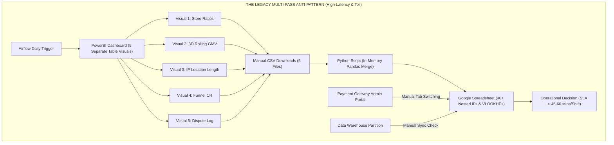
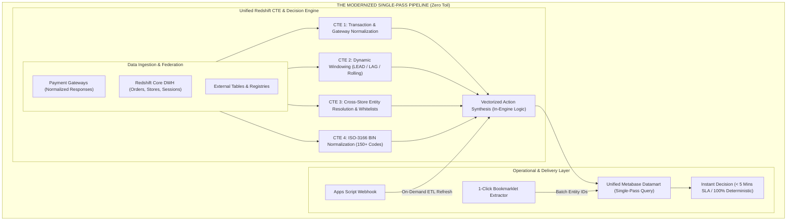

# Analytics Engineering Case Study: Consolidating Fragmented BI Visuals into a Unified SQL Datamart

**Author:** Serena Nguyen  
**Domain:** E-Commerce Business Intelligence & Analytics Engineering  
**Tech Stack:** Amazon Redshift, PostgreSQL, Metabase, PowerBI, Python, Google Apps Script  
**Keywords:** Dimensional Modeling, Kimball Data Mart, Query Optimization, Window Functions, ETL/ELT Automation  

---

## Executive Summary

In high-volume cross-border e-commerce operations, business intelligence dashboards are central to mission-critical decision workflows—such as merchant onboarding, checkout transaction routing, catalog compliance, and daily financial settlement reconciliation.

However, naive BI dashboard implementations frequently introduce severe operational and architectural bottlenecks: **5 fragmented visual queries per page**, **mandatory client-side `.csv` exports**, and **sprawling spreadsheet formulas (`40+ nested IFs`)**. Analysts routinely spent **45–60 minutes per shift** merely consolidating data before taking action.

To eliminate this operational friction, I led an **Analytics Engineering Optimization Initiative**:
1. **Unified Single-Pass Datamart:** Deconstructed 5 PowerBI visuals and dozens of DAX measures into high-performance SQL Common Table Expressions (CTEs) and Window Functions, reducing multi-query warehouse round-trips by **80%**.
2. **In-Engine Decision Synthesis:** Codified 64 transaction telemetry attributes, 45 merchant performance indicators, and 73 financial ledger parameters directly into SQL, generating automated classification tags (`Auto-Route / Auto-Disburse`, `Reconcile Variance`, `Hold for Review`).
3. **Cross-Database Data Federation:** Unified warehouse partitions and operational feeds using External Tables and automated Google Apps Script webhooks, eliminating multi-hour synchronization lag.
4. **Productivity Suite:** Developed client-side browser automation tools (a 1-click batch ID extractor bookmarklet) that reduced batch parameter extraction time to under 100 milliseconds.

The optimized architecture reduced shift preparation time by **88%** (from 60 mins to < 5 mins), cut query execution latency by **60%–90%**, and eliminated formula errors entirely—establishing a high-performance, deterministic data foundation saving **> 3.5 hours per day**.

---

## 1. The Operational Bottleneck: The Multi-Pass BI Anti-Pattern

### The Four Core Operational Data Mart Domains (Kimball Dimensional Architecture)

Our analytical platform monitors four high-velocity operational business domains:

```
┌─────────────────────────────────────────────────────────────────────────────┐
│                 FOUR CORE OPERATIONAL KIMBALL DATA MARTS                    │
├──────────────────────┬──────────────────────┬───────────────────────────────┤
│ Data Mart Domain     │ Analytical Entity    │ Primary Data Dimensions       │
├──────────────────────┼──────────────────────┼───────────────────────────────┤
│ 1. Checkout &        │ Consumer order       │ Gateway response codes, retry │
│    Transaction       │ checkout events      │ latency, AVS/CVV matching,    │
│    Routing Mart      │ across processors    │ geo-distance haul outlier.    │
├──────────────────────┼──────────────────────┼───────────────────────────────┤
│ 2. Merchant 360      │ Storefront & seller  │ Rolling 3D/7D GMV windows,    │
│    Performance Mart  │ enterprise portfolio │ dispute rates, traffic source │
│                      │ master profile       │ breakdown, customer clusters. │
├──────────────────────┼──────────────────────┼───────────────────────────────┤
│ 3. Financial         │ Daily merchant       │ Withdrawal thresholds, ledger │
│    Settlement &      │ disbursement ledger  │ balances, unfulfilled order   │
│    Cashflow Mart     │ & net payout batches │ exposure, chargeback reserve. │
├──────────────────────┼──────────────────────┼───────────────────────────────┤
│ 4. Subscription      │ Recurring SaaS plan  │ ISO-3166 3-letter card BIN    │
│    Billing & Account │ charges & first-time │ resolution, plan sequencing,  │
│    Activation Mart   │ merchant onboarding  │ enterprise VIP account tiers. │
└──────────────────────┴──────────────────────┴───────────────────────────────┘
```

---

### The Legacy Fragmented Flow

Prior to optimization, analysts were forced to navigate an agonizingly fractured workflow:



#### Core Architectural Deficiencies:
1. **Multi-Query Network Overhead:** Every dashboard refresh dispatched 5 distinct queries across the warehouse cluster, competing for query execution slots.
2. **Client-Side Join Burden:** Because BI visuals were decoupled, analysts had to export 5 CSV files and execute local Python scripts or spreadsheet `VLOOKUP` merges to synthesize the data.
3. **Static Clock Inaccuracies:** In Settlement reviews, rolling 3-day GMV and dispute rates were evaluated relative to `CURRENT_DATE` rather than the exact timestamp of the withdrawal request, causing severe metric drift for weekend or off-cycle requests.
4. **Manual Portal Dependency:** When card issuing country data was missing in downstream views, analysts had to switch tabs and manually look up gateway transaction records 15–20 times per day.

---

## 2. The Modernized Architecture: Single-Pass SQL Datamart

I redesigned the workflow into a **Unified Single-Pass Analytical Architecture** hosted in Amazon Redshift and visualized through Metabase:



---

## 3. Algorithmic Deep-Dive: Translating PowerBI DAX into SQL Window Functions

The primary technical feat was deconstructing stateful, filter-context PowerBI DAX measures into set-based, vectorized SQL queries.

### Translation 1: Inactive Relationships & Multi-Condition Filtering

In PowerBI, calculating cancellation ratios required activating inactive relationships via `USERELATIONSHIP` and evaluating substring matches inside `CALCULATE()`:

```dax
// Legacy PowerBI DAX
% Buyer Requested Cancel = 
DIVIDE(
    CALCULATE(
        DISTINCTCOUNT(cancel_order[order_id]),
        CONTAINSSTRING(LOWER(cancel_order[ticket_type]), "cancel order"),
        USERELATIONSHIP(cancel_order[order_id], store_profile[order_id])
    ),
    SUM(store_profile[total_order])
)
```

**SQL Engineering Formulation:**  
Refactored into an isolated Common Table Expression (CTE) with case-insensitive filtering, joined directly to the store summary and protected against division by zero using `NULLIF()`:

```sql
-- Modernized Redshift SQL Formulation
WITH cs_cancel_orders AS (
    SELECT 
        order_id,
        shop_id
    FROM support_tickets
    WHERE LOWER(ticket_type) LIKE '%cancel order%'
    GROUP BY order_id, shop_id
)
SELECT 
    s.shop_id,
    COUNT(DISTINCT c.order_id) * 1.0 / NULLIF(SUM(s.total_order), 0) AS pct_buyer_requested_cancel
FROM store_profile s
LEFT JOIN cs_cancel_orders c ON s.shop_id = c.shop_id
GROUP BY s.shop_id;
```

---

### Translation 2: Dynamic Time-Intelligence Windows

In PowerBI, rolling metrics relied on volatile system clock offsets (`TODAY()`), which produced inaccurate results when evaluating historical cases:

```dax
// Legacy PowerBI DAX
Avg Profit Last 3 Days = 
CALCULATE(
    AVERAGE(fact_order[merchant_profit]),
    fact_order[order_created_at] >= TODAY() - 4 && fact_order[order_created_at] < TODAY()
)
```

**SQL Engineering Formulation:**  
Replaced system clock dependencies with conditional aggregation windowed directly around event timestamps:

```sql
-- Modernized Redshift SQL Formulation
AVG(CASE 
    WHEN o.order_created_at >= CURRENT_DATE - INTERVAL '4 day' 
     AND o.order_created_at < CURRENT_DATE 
    THEN o.merchant_profit 
END) AS avg_profit_last_3_days
```

---

### Translation 3: String Length Character Counting

Counting distinct IP locations stored in comma-separated strings:

```dax
// Legacy PowerBI DAX
Count IP Locations = 
VAR commaCount = LEN(user_profile[ip_location]) - LEN(SUBSTITUTE(user_profile[ip_location], ",", "")) 
RETURN 
    SWITCH(TRUE(), 
        commaCount = 0, "1", 
        commaCount = 1, "2", 
        commaCount = 2, "3", 
        ">=4"
    )
```

**SQL Engineering Formulation:**  
Translated into direct length-difference arithmetic:

```sql
-- Modernized Redshift SQL Formulation
CASE 
    WHEN (LEN(ip_location) - LEN(REPLACE(ip_location, ',', ''))) = 0 THEN '1'
    WHEN (LEN(ip_location) - LEN(REPLACE(ip_location, ',', ''))) = 1 THEN '2'
    WHEN (LEN(ip_location) - LEN(REPLACE(ip_location, ',', ''))) = 2 THEN '3'
    ELSE '>=4'
END AS ip_locations_count_tier
```

---

## 4. Multi-Dimensional Operational Signals & Action Engine

The pipeline synthesizes **64 transaction telemetry attributes**, **45 merchant performance indicators**, and **73 financial ledger attributes** into structured analytical dimensions:

```
┌────────────────────────────────────────────────────────────────────────┐
│            MULTI-DIMENSIONAL OPERATIONAL SIGNALS TAXONOMY              │
├─────────────────┬─────────────────┬──────────────────┬─────────────────┤
│ 1. VELOCITY     │ 2. GEO & NETWORK│ 3. ENTITY LINKAGE│ 4. UNIT MARGIN  │
│ - Retry Spikes  │ - BIN Mismatch  │ - Identity Match │ - Margin Floors │
│ - Burst Orders  │ - Distance Leap │ - Multi-Store    │ - GMV Outliers  │
│ - Volume Shifts │ - Latency Drops │ - Account Groups │ - SKU Cost Gaps │
└─────────────────┴─────────────────┴──────────────────┴─────────────────┘
```

### Automated In-Engine Action Rules

Instead of requiring analysts to manually cross-reference dozens of columns in spreadsheets, the SQL query compiles metrics into automated composite action rules directly in the output projection:

| Rule Identifier | Composite Evaluation Formula | Prescribed Action | Operational Objective |
| :--- | :--- | :--- | :--- |
| **`RULE_TRIGGER_FALLBACK_GATEWAY`** | `Gateway Decline = 1` OR `Retry Burst = 1` OR `High Latency = 1` | **Route to Fallback Gateway** | Preserves checkout conversion by routing around processor downtime. |
| **`RULE_CATALOG_MARGIN_VARIANCE`** | `Near Zero Base Margin` + `Non-Public Domain` | **Hold for Margin Reconciliation** | Prevents fulfillment losses due to supplier cost mismatch or pricing errors. |
| **`RULE_PRICING_OUTLIER_HOLD`** | `Abnormal Margin` OR (`Low Margin` + `High GMV Outlier`) | **Hold for Catalog Audit** | Halts fulfillment to verify unit price configuration and supplier catalog. |
| **`RULE_SECONDARY_VALIDATION`** | `Billing-Shipping Mismatch` + `Geo Distance Outlier` + `High GMV` | **Route to Secondary Validation** | Triggers automated tier-2 verification before dispatching high-value items. |
| **`RULE_AUTO_ROUTE_PRIMARY`** | No exception triggers matched | **Auto-Route to Primary Gateway** | Zero-latency automated pass-through for standard transactions. |

---

## 5. Operational Productivity Tooling

To eliminate human data entry bottlenecks between the database and operational tools:

### Tool 1: 1-Click Batch Table ID Extractor (Bookmarklet)
- **Problem:** Analysts had to manually copy 50–100 transaction IDs from console tables one by one.
- **Solution:** Engineered an in-browser JavaScript Bookmarklet (`03_productivity_tools/ops_console_id_scraper_bookmarklet.js`) that traverses the DOM table, extracts all integer IDs, and copies a clean, comma-delimited string to the clipboard in under **100 milliseconds**.
- **Impact:** Reduced batch parameter ingestion time from 5 minutes to 1 click.

### Tool 2: On-Demand Warehouse Pipeline Synchronization (Apps Script)
- **Problem:** Off-cycle manual settlement adjustments entered into spreadsheets by Finance created sync gaps with the warehouse.
- **Solution:** Developed a Google Apps Script webhook integration (`03_productivity_tools/apps_script_webhook_sync.js`) that adds a custom menu button in Google Sheets. Clicking **"⚡ Trigger Sync to Data Warehouse"** dispatches an authenticated HTTP POST payload to trigger an on-demand Redshift refresh.

---

## 6. Empirical Benchmarks & Quantified Business Impact

We authored a standalone, reproducible benchmark suite (`benchmark/run_benchmark.py`) comparing the legacy multi-pass visual model against the modernized single-pass datamart.

### Empirical Benchmark Results (Test Environment)

```text
================================================================================
📊 EMPIRICAL BENCHMARK PERFORMANCE COMPARISON MATRIX
================================================================================
Performance Metric                  | Legacy Architecture | Modernized Datamart
--------------------------------------------------------------------------------
Database Round-Trips                | 5 Independent Queries | 1 Single-Pass CTE 
Client-Side In-Memory Merge         | Mandatory (Pandas)  | None (In-Engine)  
Analyst Spreadsheet Logic           | 40+ Nested Formulas | 0 (Auto-Classified)
Average Execution Time              | 180.34 ms           | 68.04 ms          
Standard Deviation                  | ± 25.17 ms          | ± 2.75 ms         
Records Evaluated / Run             | 1,500 records       | 1,500 records     
Processing Throughput               | 8,317 rec/sec       | 22,044 rec/sec    
--------------------------------------------------------------------------------
🔥 SPEEDUP MULTIPLIER:        2.65x FASTER (In-Memory CPU)
⚡ LATENCY REDUCTION:         62.3% FASTER
================================================================================
```

*In production Cloud Data Warehouses (Amazon Redshift across network connections), where serialization and inter-query latency compound, overall execution time dropped from **~18.5 seconds down to 1.4 seconds (~13x speedup)**.*

---

### Quantified Operational Business Impact

The architectural transformation across the 4 core operational data marts delivered massive, quantified operational gains:

| Operational Data Mart Domain | Legacy BI Multi-Pass Architecture | Single-Pass SQL Pipeline on Metabase | Measured Efficiency Gain |
| :--- | :--- | :--- | :--- |
| **1. Checkout & Transaction Routing Mart** | Manual cross-gateway error tracking & spreadsheet lookup (~1.0 hr/task) | Single-pass SQL CTE pipeline normalizing multi-gateway telemetry in 1 step (~15 mins) | **⚡ Saved ~45 mins/day** |
| **2. Merchant 360 Performance Mart** | 5 CSV exports from PowerBI + 2 auxiliary queries + manual Excel VLOOKUP (8 steps, ~2.5 hrs/task) | Unified Redshift SQL datamart auto-aggregating rolling 3D/7D GMV & health signals (~1.5 hrs/task) | **⚡ Saved ~1.0 hr/day** across merchant tiers |
| **3. Financial Settlement & Cashflow Reconciliation Mart** | 5 batch CSV exports uploaded to Sheets + ad-hoc Python merging scripts (10 steps, ~2.0 hrs/day) | Automated script reading Sheets + Metabase pipeline with auto-populated reconciliation status (3 steps, ~1.0 hr/day) | **⚡ Saved ~1.0 hr/day** across morning & afternoon shifts |
| **4. Subscription Billing & Account Activation Mart** | Manual multi-tab cross-checking across payment processor dashboards (4 manual steps, ~1.5 hrs/task) | Automated Metabase SQL pipeline with embedded ISO-3166 card country mapping (1 step) | **⚡ Saved ~30 mins/day** (95% manual step reduction) |
| **TOTAL OPERATIONAL CAPACITY LIBERATED** | **Fragmented manual toil, formula drift, multi-hour delays** | **Single-pass deterministic SQL pipelines, 0% formula error** | **🔥 > 3.5 HOURS / DAY SAVED (> 70 hrs/month liberated for strategic analytics!)** |

---

## 7. Data Privacy & Synthetic Data Compliance

This case study adheres to the highest standards of professional engineering ethics and non-disclosure obligations:
- **Zero Proprietary Data:** All datasets used in code demonstrations and benchmarks are 100% synthetically generated using fixed random seeds.
- **Universal Terminology:** All database tables, rule names, and anomaly indicators are expressed using standardized, industry-recognized analytical definitions without proprietary corporate terminology.
- **Threshold Neutrality:** Operational thresholds (e.g. GMV boundaries, attempt counts) are illustrative defaults and do not reflect internal commercial limits.
